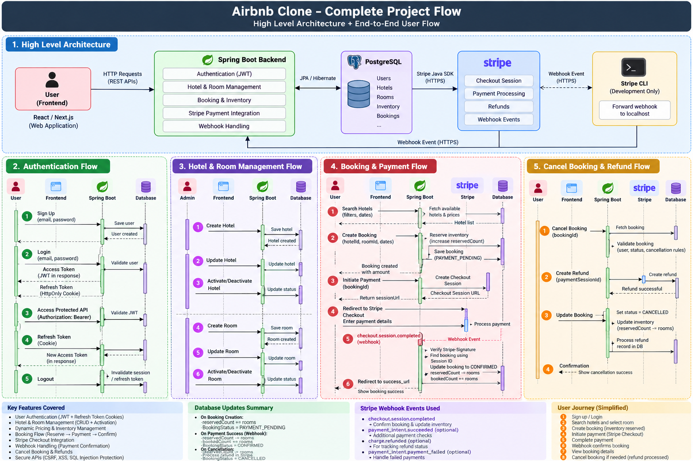
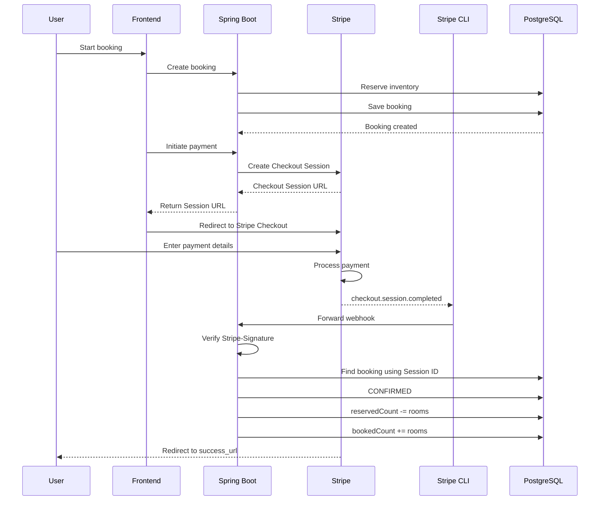

# 🏠 Airbnb Clone

A backend implementation of an Airbnb-like hotel booking and management platform built using **Spring Boot** and **PostgreSQL**.

The application supports hotel and room management, date-wise inventory management, dynamic pricing, booking, secure payments using **Stripe Checkout**, Stripe webhooks, payment confirmation, cancellation, and refunds.

---
## 🛠️ Tech Stack

**Backend:**  


**Database:**  


**Payments:**  


**Tools:**  


---
## 📌 Features

### 🔐 Authentication & Security
- User registration and login
- JWT-based authentication
- Refresh tokens using HttpOnly cookies
- Google OAuth2 authentication
- Role-based access control
- CSRF, XSS, and SQL injection protection

### 🏨 Hotel & Room Management
- Hotel management
- Room management
- Date-wise room inventory
- Dynamic room pricing
- Hotel search with pagination

### 📅 Booking & Inventory
- Booking creation and management
- Inventory reservation and availability tracking
- Pessimistic locking for concurrent inventory updates

### 💳 Payments
- Stripe Checkout integration
- Stripe webhook-based payment confirmation
- Booking cancellation
- Stripe refund processing


---
## 🔄 Project Flow
The diagram below provides a high-level overview of the application's major components and the flow between authentication, hotel management, search, booking, Stripe payments, webhook-based confirmation, and cancellation/refunds.




---
## 🗄️ Database Structure


---
## 💡 Doubt
### Room vs Inventory 

Why are we creating a separate `Inventory` entity when we could simply put the inventory-related fields inside of `Room` entity?
As we know room entity represents room-type. So, we can simply populate/multiply/create multiple room-entries for each date, for each room type, for the next one year.

### ✅ Ans

We can do so. But then for each entry of the room, for a new date, we are duplicating fields which are constants for long period.

Fields like: `photos`, `amenities`, `capacity`, `basePrice`, `type`.

| Entity | Represents |
|---|---|
| **Room** | Relatively permanent information |
| **Inventory** | Date-specific information |

So our database design is basically:

```text
Hotel
 |
 └── Room (Deluxe)
      |
      ├── Inventory (Sep 10)
      ├── Inventory (Sep 11)
      ├── Inventory (Sep 12)
      └── Inventory (Sep 13)
```

--- 

## 💳 Stripe Payment Integration

This project integrates **Stripe Checkout** for handling payments, payment
confirmation through webhooks, booking cancellation, and refunds.

### 🔄 Payment Flow Overview

The payment flow consists of two important parts:

1. **Checkout Session** – used to create the Stripe-hosted payment page.
2. **Webhook** – used by the backend to reliably know whether the payment
   was completed.

> The `success_url` only redirects the customer back to the application.
> The backend does not rely on this redirect to confirm a payment.
> Payment confirmation is handled through Stripe webhooks.

---

## 🧪 Payment Flow During Local Development

During local development, the backend is running on `localhost`, which
Stripe's servers cannot directly reach.

Therefore, **Stripe CLI** is used to forward webhook events from Stripe
to the local Spring Boot application.



### Local vs Production

| Environment | Webhook Flow |
|-------------|--------------|
| Local Development | `Stripe → Stripe CLI → Local Spring Boot` |
| Production | `Stripe → Public HTTPS Backend` |

---
## 🧪 API Testing
The deployed API can be tested using Postman.

### Prerequisites

- Install [Postman](https://www.postman.com/downloads/)
- No local database setup is required.
- The backend is deployed on Railway.

### Import Postman Collection

1. Download the Postman collection:
   `postman/AirBnbClone.postman_collection.json`

2. Open Postman.

3. Click **Import**.

4. Select the downloaded JSON file.

5. The `AirBnbClone` collection will be imported.

### Base URL

The collection uses the following deployed backend:

```text
https://airbnbclone-production-d729.up.railway.app/api/v1
```


---
## 🚀 Getting Started

### Prerequisites

Make sure the following are installed:

- Java 17+
- Maven
- PostgreSQL
- Stripe CLI

### 1. Clone the repository

### 2. Configure `.env`

```
# PostgreSQL
DB_URL=
DB_USERNAME=
DB_PASSWORD=

# JWT
JWT_SECRETKEY=

# Stripe
STRIPE_SECRET_KEY=
STRIPE_WEBHOOK_SECRET=

```

### 3. Run the application

### 4. Start Stripe CLI for local webhook testing

For local Stripe payment testing, Stripe CLI is used to forward webhook events from Stripe to the local Spring Boot application.

First, log in to Stripe CLI:

```bash
stripe login
```

Then start the webhook listener:

```bash
stripe listen --events checkout.session.completed --forward-to localhost:8080/api/v1/webhook/payment
```

Stripe CLI will display a webhook signing secret similar to:

```text
whsec_********
```

Add this secret to your local environment:

```env
STRIPE_WEBHOOK_SECRET=whsec_********
```


---
## 📅 Production Considerations

The following improvements can be added for a production deployment:

- Webhook idempotency
- Payment event persistence
- Webhook retry handling
- Payment reconciliation
- Booking expiration for unpaid bookings
- Redis caching
- Centralized logging
- Monitoring and alerting
- Secret management
- HTTPS
- Rate limiting


## 👨‍💻 Author

**Ashish Redhu**

- GitHub: [Ashish Redhu](https://github.com/ARedhu)
- LinkedIn: [Ashish Redhu](https://www.linkedin.com/in/ashish-redhu/)

If you found this project useful, feel free to ⭐ the repository.
